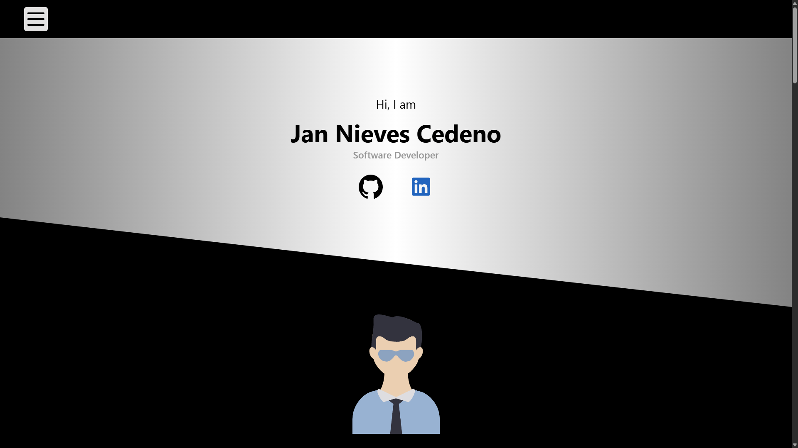

# Portfolio Website

A responsive static portfolio website showcasing software development projects and professional experience.

## 🚀 Quick Start

Simply open `index.html` in your browser - no build tools required.

## ✨ Features

### Navigation
Responsive hamburger menu with smooth scrolling to all sections.

### Presentation
Introduction section with social media links (GitHub, LinkedIn) and professional title.

### Projects
Showcase of three main projects with technology stack icons and GitHub repository links:
- Portfolio App (Flask, Python, SQLite)
- Online Movies Web (PHP, MySQL)
- Online Movies Android (Java, Android Studio)

### Curriculum
Complete CV section including experience, education, skills, and professional summary.

### Contact
Functional contact form integrated with Web3Forms for direct messaging.

## 🛠️ Technologies

- HTML5, CSS3, JavaScript
- Modular CSS architecture (5 separate stylesheets)
- Web3Forms API for contact functionality